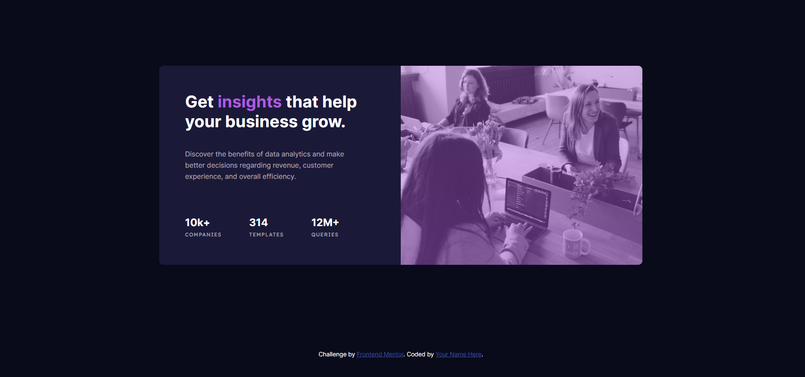
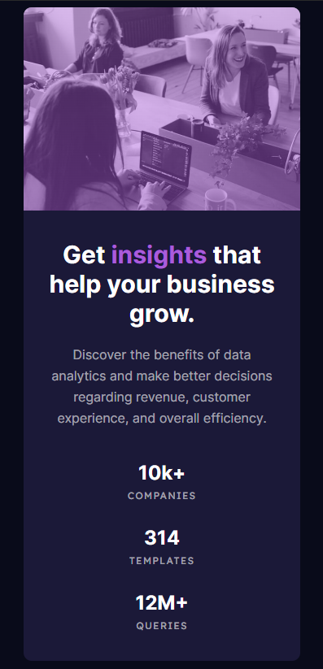

# Status Preview Card Component 👨‍💻

## Project Overview 🌟

This is a front-end coding challenge completed for [Frontend Mentor](https://www.frontendmentor.io). The challenge was to build a status preview card component and make it look as close to the provided design as possible.

## Technologies Used 💻

- HTML
- CSS

### The Challenge 📋

The challenge required the following:

- Create an status preview card.
- View the optimal layout depending on their device's screen size.

## Screenshots 📷

## Live Demo 🚀

You can view the live demo of the project [here](https://status-preview-card-component-006.netlify.app/).